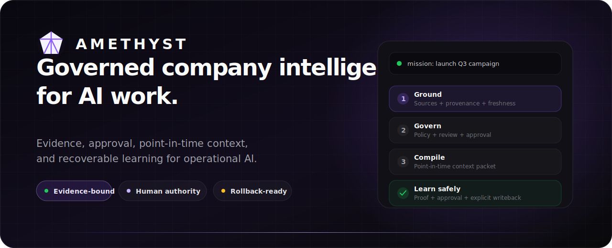
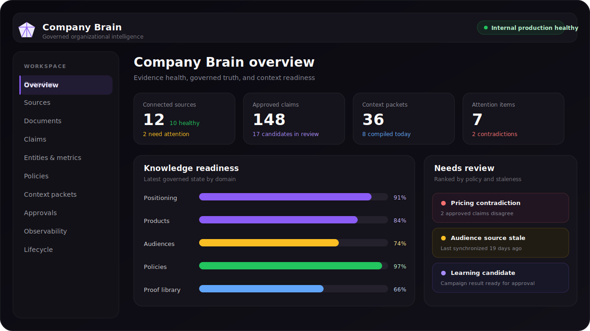
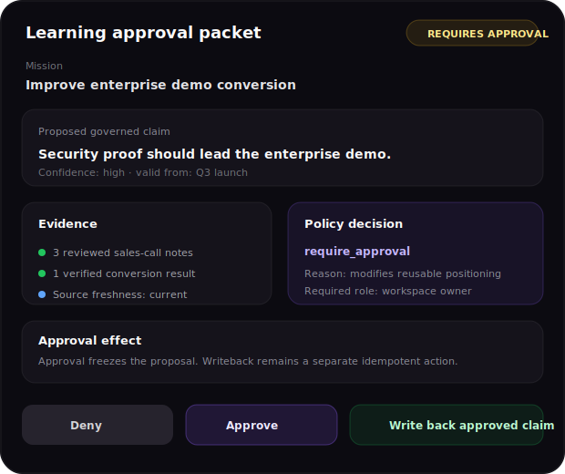
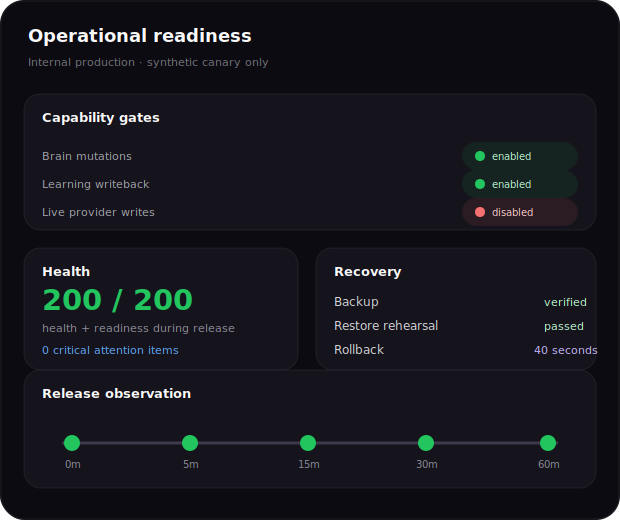
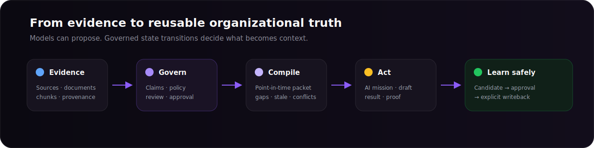

<p align="center">
  
</p>

<p align="center">
  <a href="docs/product-tour.md"><strong>Product tour</strong></a>
  &nbsp;&nbsp;·&nbsp;&nbsp;
  <a href="docs/architecture.md"><strong>Architecture</strong></a>
  &nbsp;&nbsp;·&nbsp;&nbsp;
  <a href="docs/engineering-evidence.md"><strong>Engineering evidence</strong></a>
  &nbsp;&nbsp;·&nbsp;&nbsp;
  <a href="docs/demo-script.md"><strong>Demo script</strong></a>
</p>

<p align="center">
  
  
  
  
</p>

<p align="center">
  <strong>Built by <a href="https://github.com/joyboy257">Deon Quek</a> — AI / Software Engineer.</strong><br />
  Product architecture, backend systems, AI governance, evaluation, deployment, recovery, and release controls.
</p>

> [!NOTE]
> This is the public recruiter-facing case study for Amethyst. The production repository remains private because it contains source code, deployment topology, operational runbooks, and unreleased product work.

## Recruiter quick scan

| | |
| --- | --- |
| **What I built** | A governed company-intelligence system that turns source evidence into approved claims, policies, metrics, entities, and point-in-time context for AI-assisted work. |
| **My role** | Product architect and lead engineer across product design, APIs, governance, testing, deployment, recovery, and release acceptance. |
| **Core challenge** | LLMs can summarize information, but businesses need provenance, policy, approval, freshness, contradiction handling, audit, and rollback before AI-generated work affects operations. |
| **Key surfaces** | Company Brain, source and document inspection, claim review, context packets, policy decisions, approval packets, learning writeback, lifecycle controls, observability, and release gates. |
| **Engineering posture** | Workspace-scoped, policy-enforced, idempotent, auditable, fail-closed, observable, recoverable, and evidence-gated. |
| **Verified boundary** | Core Company Brain implemented and deployed to protected internal production. External customer pilot and live provider writes remain unapproved and disabled. |

## See Company Brain in action

> The visuals below are sanitized recruiter-facing reconstructions of implemented product surfaces. They contain synthetic data and expose no production records.

<p align="center">
  
</p>

<table>
  <tr>
    <td width="50%" align="center"><strong>Governed approval packet</strong></td>
    <td width="50%" align="center"><strong>Operational readiness</strong></td>
  </tr>
  <tr>
    <td></td>
    <td></td>
  </tr>
  <tr>
    <td valign="top">A proposed learning is reviewed with its mission, result, evidence, conflicts, policy decision, and separate approval and writeback actions.</td>
    <td valign="top">Operators can inspect capabilities, disable mutation classes, observe health, rehearse restores, and verify rollback before authorizing broader use.</td>
  </tr>
</table>

## Raw evidence is not organizational truth

<p align="center">
  
</p>

The central architectural decision is simple: **models may reason and propose, but reusable organizational truth enters Company Brain only through governed backend state transitions.**

| Principle | Implementation consequence |
| --- | --- |
| **Evidence remains inspectable** | Claims retain source, document, evidence, confidence, validity, and supersession lineage. |
| **Approval is not execution** | Approval authorizes a separate idempotent writeback; it does not silently mutate Company Brain. |
| **Context is point-in-time** | AI work consumes persisted context packets rather than a mutable live prompt assembled without history. |
| **Policy is server-enforced** | Direct API calls cannot bypass deny, review, approval, or role requirements. |
| **Production authority is explicit** | Kill switches, protected staging, restore evidence, rollback measurement, observation windows, and operator decisions gate release. |

## What the system contains

<table>
  <tr>
    <td width="50%" valign="top">
      <h3>◇ Company Memory</h3>
      Connected sources, documents, chunks, provenance, freshness, sync status, and inspectable evidence.
    </td>
    <td width="50%" valign="top">
      <h3>◆ Company Brain</h3>
      Governed claims, entities, metric definitions, policies, relationships, contradictions, and supersession history.
    </td>
  </tr>
  <tr>
    <td width="50%" valign="top">
      <h3>◉ Context Compiler</h3>
      Persists mission-scoped context packets containing approved knowledge, policy decisions, missing context, stale context, and conflicts.
    </td>
    <td width="50%" valign="top">
      <h3>✓ Approval and Learning</h3>
      Builds review packets, freezes proposed claims, emits immutable decision receipts, and performs explicit idempotent writeback.
    </td>
  </tr>
  <tr>
    <td width="50%" valign="top">
      <h3>↗ Mission Surfaces</h3>
      Supplies governed context to AI-assisted missions and creative preflight while keeping publish and provider effects separately controlled.
    </td>
    <td width="50%" valign="top">
      <h3>⟳ Operations and Recovery</h3>
      Capability gates, observability, reconciliation, redacted export, deletion manifests, backup, restore rehearsal, canary, and rollback.
    </td>
  </tr>
</table>

## Selected engineering evidence

| Internal engineering evidence | Result |
| --- | ---: |
| Production capability program | **CBR-PROD-00 through CBR-PROD-07 complete** |
| Health and readiness | **200 / 200** during protected release verification |
| Measured rollback | **40 seconds**, against a 60-minute objective |
| Observation window | **0 / 5 / 15 / 30 / 60-minute checkpoints completed** |
| Mutation posture | **Writes, learning writeback, and source sync independently gated** |
| External customer pilot | **Not authorized; live provider writes remain disabled** |

These are internal implementation and deployment results, not customer-performance claims. Read the full evidence model in [`docs/engineering-evidence.md`](docs/engineering-evidence.md).

## Technical footprint

```text
Product surfaces
  Next.js web application · Company Brain · Mission and Library surfaces

Runtime
  TypeScript · Fastify API · pnpm/Turborepo

Data and integrity
  SQLite · transactional repositories · immutable audit projections · SHA-256 manifests

AI governance
  candidate claims · policies · approvals · point-in-time context packets · learning writeback

Operations
  Docker · GitHub Actions · protected staging · health/readiness · canary · rollback

Verification
  unit · integration · Playwright browser journeys · fault injection · recovery · release gates
```

## What this project demonstrates

- **Forward-deployed engineering:** translating an ambiguous organizational-memory problem into a governed operational product with explicit rollout boundaries.
- **Applied AI architecture:** separating model reasoning from approved business context and deterministic write authority.
- **Backend engineering:** transaction boundaries, idempotency, workspace isolation, immutable receipts, reconciliation, and lifecycle cascades.
- **Product engineering:** making provenance, conflicts, policies, approvals, and readiness understandable through operator surfaces.
- **Production discipline:** kill switches, observability, backup/restore, canary checks, measured rollback, and evidence-bound release authority.
- **Agentic engineering:** using coding agents as bounded workers while retaining human ownership of architecture, acceptance, and release decisions.

## Public boundaries

This showcase intentionally excludes:

- private production source code;
- customer data and source content;
- credentials and provider configuration;
- host identifiers, network topology, and incident details;
- internal commercial plans;
- unreleased customer-pilot material.

The public materials are a truthful product and architecture case study, not a simulated open-source repository. Read [`docs/disclosure-boundaries.md`](docs/disclosure-boundaries.md) before adding screenshots or recordings.

## Explore

- [`docs/product-tour.md`](docs/product-tour.md) — recruiter walkthrough and recommended demo path
- [`docs/architecture.md`](docs/architecture.md) — system boundaries, context lifecycle, transaction model, and recovery posture
- [`docs/engineering-evidence.md`](docs/engineering-evidence.md) — verification categories and release evidence
- [`docs/role-and-ownership.md`](docs/role-and-ownership.md) — what I owned and how AI coding agents were used
- [`docs/demo-script.md`](docs/demo-script.md) — a 110-second product demonstration script

---

<p align="center">
  <strong>Deon Quek</strong><br />
  AI / Software Engineer · Singapore<br />
  <a href="https://github.com/joyboy257">GitHub profile</a> · <a href="https://www.linkedin.com/in/deonquek">LinkedIn</a>
</p>