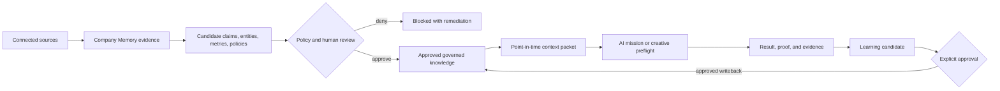

# Amethyst - Governed Company Intelligence for AI Work

> Turn fragmented company evidence into approved, point-in-time context that AI systems can use safely.

**Built by Deon Quek - product architecture, backend systems, AI governance, evaluation, deployment, and release controls.**

Amethyst is an AI Growth Operating Environment. This public case study focuses on **Company Brain**, the governed intelligence layer that converts source evidence into approved claims, policies, metrics, entities, and context packets for AI-assisted work.

The production source repository remains private. This repository contains a recruiter-facing product and engineering case study only.

## Recruiter quick scan

| | |
|---|---|
| **What I built** | A governed company-intelligence platform that compiles approved operational knowledge into point-in-time context for AI missions. |
| **Core problem** | LLMs can summarize information, but businesses need provenance, policy, approval, freshness, contradiction handling, audit, and rollback before AI-generated work affects operations. |
| **My role** | Product architect and lead engineer across domain design, APIs, governance, testing, deployment, recovery, and release acceptance. |
| **Primary stack** | TypeScript, Fastify, Next.js, SQLite, pnpm/Turborepo, Playwright, Docker, GitHub Actions. |
| **Engineering posture** | Workspace-scoped, policy-enforced, idempotent, auditable, fail-closed, observable, recoverable, and evidence-gated. |
| **Verified boundary** | Core Company Brain implemented; protected internal staging and production deployment completed. External customer pilot and live provider writes remain unapproved and disabled. |

## Why Company Brain exists

Raw company data is not automatically safe context for an AI agent.

A source can be stale. Two documents can contradict one another. A conclusion can be plausible but unapproved. A policy can prohibit an otherwise reasonable action. An earlier fact can be superseded while remaining important for audit history.

Company Brain introduces a governed path:

The model may reason, draft, and propose. The governed backend decides what becomes reusable organizational truth.

## What the system demonstrates

### Governed context compilation

Context packets contain approved claims, entities, metric definitions, policies, reusable policy decisions, missing context, stale context, and contradictions. Packets are persisted as point-in-time snapshots so later source changes do not silently rewrite the context used for an earlier decision.

### Two-phase learning

A completed mission does not directly update Company Brain. It creates a learning candidate. Approval authorizes a separate, explicit, idempotent writeback using the frozen approved proposal rather than recomputing from mutable data.

### Policy and approval enforcement

Direct API calls cannot bypass `deny`, `require_review`, or `require_approval` decisions. Approval outcomes emit immutable audit-backed decision receipts with actor, rationale, policy snapshots, and writeback status.

### Production controls

New mutations, learning writeback, and source synchronization have independent process-level kill switches. Invalid combinations fail startup. Blocked operations return safe remediation without leaking source content, prompts, credentials, or evidence text.

### Recovery and lifecycle

The system supports redacted provenance export, manifest-bound deletion, append-only deletion receipts, transactional cascades, online backup, restore rehearsal, tombstone replay, integrity checks, health verification, and rollback evidence.

## Deployment and verification status

The repository-side production program passed:

- protected staging preflight;
- backup and isolated restore rehearsal;
- production-topology deployment;
- health and readiness checks;
- Company Brain and browser smoke tests;
- a measured **40-second rollback** against a 60-minute objective;
- a full **0/5/15/30/60-minute observation window**;
- explicit operator go/no-go acceptance.

These are internal engineering and deployment results. They are **not** external customer-performance claims.

## Architecture

Read [docs/architecture.md](docs/architecture.md) for the system boundaries, transaction model, context lifecycle, and deployment posture.

## Engineering evidence

Read [docs/engineering-evidence.md](docs/engineering-evidence.md) for implementation status, test categories, operational proof, and explicit claim boundaries.

## Product tour

Read [docs/product-tour.md](docs/product-tour.md) for a screen-by-screen recruiter walkthrough and the recommended two-minute demo path.

## How I used AI coding agents

I used coding agents as bounded implementation workers. I retained responsibility for product decisions, architecture, work decomposition, acceptance criteria, evidence review, release authority, and deployment boundaries. A worker could not turn a plausible implementation into an approved release merely by declaring completion.

This workflow is described in [docs/role-and-ownership.md](docs/role-and-ownership.md).

## Public boundaries

This case study intentionally excludes:

- private source code;
- customer data and source content;
- credentials and provider configuration;
- host identifiers, network topology, and incident details;
- internal commercial plans;
- unreleased customer-pilot material.

Read [docs/disclosure-boundaries.md](docs/disclosure-boundaries.md) before adding screenshots or demo recordings.

## About me

**Deon Quek**  
AI / Software Engineer - Singapore  
GitHub: <https://github.com/joyboy257>  
LinkedIn: <https://www.linkedin.com/in/deonquek>
