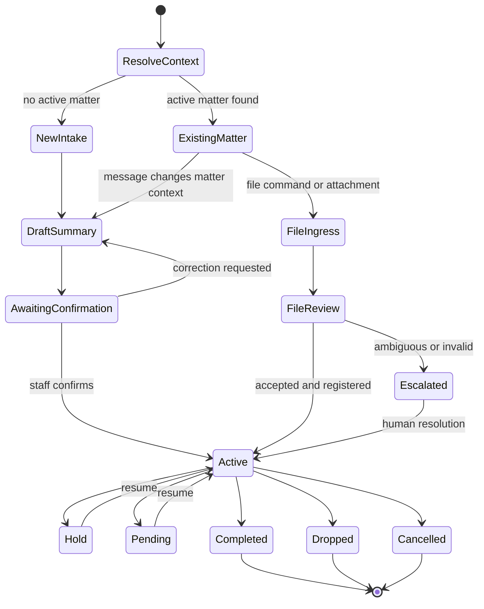
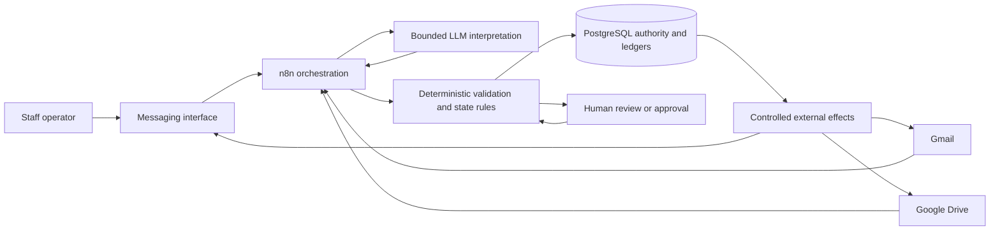
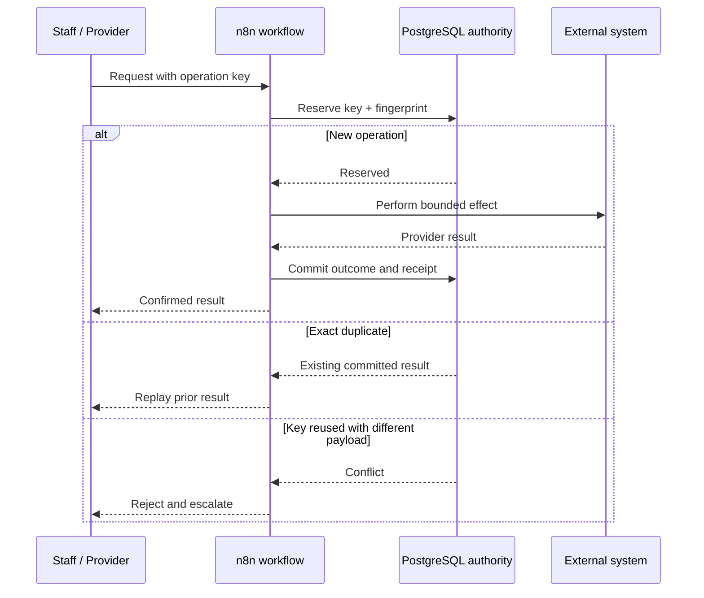

# Amelia Bot

## Sanitised production AI workflow showcase

> **Confidentiality note:** Amelia Bot is a recruiter-facing alias for a production workflow built for a private professional-services client. This showcase uses synthetic labels and omits the client's identity, customer information, matter identifiers, credentials, provider configuration, production URLs, raw workflow exports, and proprietary operating rules.

## Recruiter quick scan

| | |
| --- | --- |
| **What I built** | A staff-facing AI-assisted operations bot for intake, matter state, document ingress, routing, and controlled follow-up across messaging, email, cloud storage, workflow automation, and PostgreSQL. |
| **Production status** | Deployed for a private client and adopted by staff for real operational work. |
| **My role** | Product discovery, workflow architecture, state-machine design, n8n orchestration, PostgreSQL authority, integration boundaries, idempotency, testing, remediation, and release decisions. |
| **Core challenge** | Use language models for messy human input without allowing probabilistic output to become authoritative business state or create duplicate external effects. |
| **Primary stack** | n8n, PostgreSQL, Telegram, Gmail, Google Drive, bounded LLM calls, deterministic validation, and operational ledgers. |
| **Measured outcome** | Live staff adoption. No unsupported revenue or time-saving figure is claimed. |

## The business problem

A professional-services team coordinated intake and document operations across staff messages, email, and cloud storage. Important context could be fragmented across systems, while retries, duplicate delivery, ambiguous references, and inconsistent file handling created operational risk.

The system needed to:

- turn informal staff messages into structured, reviewable work;
- preserve matter and session state across multiple interactions;
- register and route files without silently losing or duplicating them;
- keep humans in control of ambiguous or consequential decisions;
- provide durable evidence of what was requested, decided, attempted, and committed.

## Production workflow

A typical path was:

1. Resolve the active matter or create a bounded new-intake session.
2. Parse unstructured input into a structured draft and request missing information.
3. Require staff confirmation before authoritative summary or state changes.
4. Accept, register, stage, classify, and route files through controlled integrations.
5. Commit state, idempotency records, and execution evidence, then return a clear outcome or escalation.

## System boundary

The key architectural rule was:

> **The model may interpret, classify, and draft. Deterministic services and PostgreSQL decide whether business state changes.**

## Where AI, deterministic code, and people were used

| Boundary | Used for | Why |
| --- | --- | --- |
| **LLM** | Message parsing, classification, field extraction, summary drafting, and bounded interpretation. | Useful for ambiguous human language, but unsuitable as the authority for identity, state, permissions, or completion. |
| **Deterministic code** | Matter/session resolution, state transitions, file rules, idempotency, validation, routing, retries, and database writes. | These operations require repeatability, explicit invariants, and auditable failure behaviour. |
| **Human approval** | Ambiguous matter matches, summary confirmation, exceptional files, and consequential external actions. | The operator retains authority where missing context or consequences exceed the automation boundary. |

## My exact contribution

I personally owned:

- discovery of the real staff workflow and its failure modes;
- decomposition into explicit intake, state, file, and exception paths;
- the n8n orchestration and integration boundaries;
- PostgreSQL transaction, ledger, and source-of-truth decisions;
- idempotency and duplicate-delivery behaviour;
- human confirmation and escalation boundaries;
- scenario testing, production remediation, evidence review, and release decisions.

I used AI coding agents to accelerate implementation, review, and investigation. I remained responsible for architecture, task boundaries, validating generated changes, interpreting evidence, diagnosing failures, and deciding whether work was safe to release.

## Failure converted into permanent prevention

### Failure class: repeated events reaching the same mutation path

User retries, provider redelivery, or workflow retries could cause the same requested operation to reach a write path more than once. Large orchestration nodes also made it difficult to prove which component owned the final mutation.

### Permanent prevention

- Generate an operation-level idempotency key and payload fingerprint.
- Make the PostgreSQL transaction and unique ledger the final mutation authority.
- Replay the previous result for a true duplicate.
- Reject reuse of the same key with a different payload.
- Record outcome evidence before acknowledging completion.
- Test duplicate delivery, retry, stale-state, and partial-provider-success scenarios.

## Evaluation, monitoring, and escalation

The engineering evidence included:

- scenario tests for new intake, existing matters, summary confirmation, file handling, hold, pending, resume, drop, and cancel paths;
- duplicate-delivery, retry, stale-state, invalid-input, and partial-success negative cases;
- PostgreSQL transaction and authority checks;
- n8n execution history for orchestration visibility;
- durable ledgers and receipts for authoritative operational evidence;
- explicit exception routes for ambiguous identity, invalid files, provider failures, timeout, and human review.

## Measured outcome

The strongest defensible outcome is **live staff adoption**: staff use the workflow for real operational work.

The workflow automates portions of intake, structured summary capture, matter-state tracking, file registration and routing, and operational follow-up. I do not currently have an audited revenue or time-saved measurement, so I do not present one.

A next measurement layer would track:

- active staff usage;
- cycle time from intake to confirmed state;
- manual touches per matter;
- exception and rework rates;
- workflow completion rate.

## Public boundaries

This showcase intentionally excludes:

- the client's real identity and brand;
- customer or matter data;
- raw workflow JSON and proprietary business rules;
- credentials, folder identifiers, production endpoints, and infrastructure topology;
- private incident details and provider configuration;
- unverified commercial or productivity claims.

The public material demonstrates the architecture, ownership, engineering judgement, and production boundary without exposing confidential implementation or client information.

## Supporting documents

- [Architecture and authority model](architecture.md)
- [Engineering evidence and evaluation](engineering-evidence.md)
- [Disclosure boundaries](disclosure-boundaries.md)

---

**Deon Quek**  
AI / Software Engineer - Singapore  
[GitHub profile](https://github.com/joyboy257)