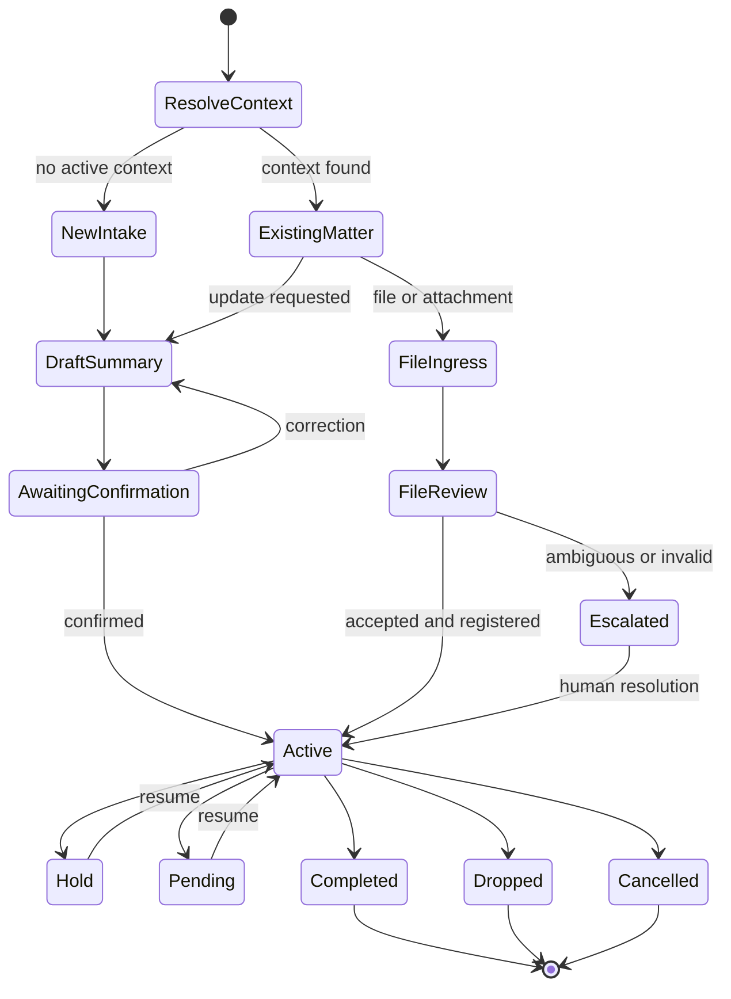

<p align="center">
  
</p>

<p align="center">
  <a href="product-tour.md"><strong>Product tour</strong></a>
  &nbsp;&nbsp;·&nbsp;&nbsp;
  <a href="architecture.md"><strong>Architecture</strong></a>
  &nbsp;&nbsp;·&nbsp;&nbsp;
  <a href="engineering-evidence.md"><strong>Engineering evidence</strong></a>
  &nbsp;&nbsp;·&nbsp;&nbsp;
  <a href="role-and-ownership.md"><strong>Role and ownership</strong></a>
  &nbsp;&nbsp;·&nbsp;&nbsp;
  <a href="demo-script.md"><strong>Demo script</strong></a>
</p>

<p align="center">
  
  
  
  
  
</p>

<p align="center">
  <strong>Built by <a href="https://github.com/joyboy257">Deon Quek</a> — AI / Software Engineer.</strong><br />
  Product discovery, workflow architecture, database authority, AI boundaries, production remediation, evaluation, and release decisions.
</p>

> [!NOTE]
> **Amelia Bot is a recruiter-facing alias for a production system built for a private professional-services client.** Every visual uses synthetic labels. This showcase excludes the client's identity, customer information, matter identifiers, credentials, production URLs, proprietary rules, and raw workflow exports.

## Recruiter quick scan

| | |
| --- | --- |
| **What I built** | A staff-facing AI-assisted operations bot for intake, persistent matter state, document ingress, routing, external effects, and controlled follow-up. |
| **Production status** | Deployed for a private client and adopted by staff for real operational work. |
| **My role** | Product and systems owner across discovery, state-machine design, n8n orchestration, PostgreSQL authority, idempotency, testing, debugging, remediation, and release decisions. |
| **Core challenge** | Use language models for messy human input without allowing probabilistic output to become authoritative business state or create duplicate effects. |
| **Primary stack** | n8n · PostgreSQL · Telegram · Gmail · Google Drive · bounded LLM calls · deterministic validation · operational ledgers. |
| **Strongest outcome** | Live staff adoption. No unsupported revenue, accuracy, or time-saving number is claimed. |

## See the workflow in action

<p align="center">
  
</p>

The synthetic journey illustrates the operating pattern:

1. A staff member submits an informal request, command, or attachment.
2. Amelia produces a typed interpretation and asks for missing context.
3. Staff confirm or correct consequential information.
4. Deterministic rules validate identity, state, permissions, and file policy.
5. PostgreSQL commits canonical state and evidence before Amelia reports completion.

The chat surface begins and supervises work. It does not own the business truth.

## One workflow, five controlled stages

<table>
  <tr>
    <td width="20%" valign="top"><strong>1. Resolve</strong><br /><br />Find the active context or create a bounded new-intake session.</td>
    <td width="20%" valign="top"><strong>2. Interpret</strong><br /><br />Extract candidate intent, fields, document class, and missing information.</td>
    <td width="20%" valign="top"><strong>3. Confirm</strong><br /><br />Pause for staff correction or authority where consequences or ambiguity require it.</td>
    <td width="20%" valign="top"><strong>4. Commit</strong><br /><br />Validate state and record the authoritative operation, ledger, and outcome.</td>
    <td width="20%" valign="top"><strong>5. Reconcile</strong><br /><br />Return evidence, retry safely, or escalate uncertain and partial provider effects.</td>
  </tr>
</table>

## Models interpret. Governed systems decide.

<p align="center">
  
</p>

| Boundary | Responsibility | Prohibited behaviour |
| --- | --- | --- |
| **LLM interpretation** | Parse language, classify input, extract candidate fields, draft summaries and clarification questions. | Cannot confirm identity, authorize a transition, bypass review, or declare an external effect successful. |
| **Deterministic controllers** | Validate schemas, resolve canonical context, enforce state and file rules, check permissions, and choose retry or escalation behaviour. | Cannot invent missing business facts or silently soften a failed invariant. |
| **PostgreSQL authority** | Own transactions, idempotency keys, payload fingerprints, canonical workflow state, ingress records, and outcome evidence. | Cannot be replaced by n8n execution history or a model-generated success message. |
| **Human authority** | Confirm summaries, resolve ambiguity, approve exceptional or consequential operations, and decide unresolved cases. | Is never hidden inside an autonomous loop. |
| **n8n orchestration** | Coordinate bounded controllers, integrations, correlation identifiers, and observable workflow execution. | Does not remain the hidden final mutation authority inside giant code nodes. |

## Workflow states



This is a long-running operational state machine, not a one-shot chatbot exchange. Each non-happy path has an explicit state, recovery rule, or human destination.

## Failure converted into permanent prevention

### Repeated events reaching one mutation

The same requested operation could arrive through:

- a staff retry or repeated button press;
- provider redelivery;
- an n8n retry after timeout;
- partial provider success followed by uncertain acknowledgement.

Orchestration history alone could not safely decide whether the work was new, already committed, conflicting, or only partially completed.

### Database-backed prevention

```text
operation key + payload fingerprint
              │
              ▼
      PostgreSQL reservation
              │
     ┌────────┼─────────┐
     ▼        ▼         ▼
   new     exact      changed
operation  replay     payload
     │        │         │
 execute   return     reject +
 safely    receipt    escalate
```

The permanent contract is:

- a new key and payload can reserve an operation;
- the same key and payload replay the committed result;
- the same key with a different payload is a conflict;
- uncertain partial success is reconciled before another effect;
- completion is reported only after durable outcome evidence exists;
- duplicate, retry, stale-state, and partial-success cases remain regression inputs.

## Evidence and production claim

| Evidence class | What it covers |
| --- | --- |
| **Workflow scenarios** | New intake, current-context resolution, summary correction and confirmation, file handling, state operations, and manual review. |
| **Negative cases** | Duplicate delivery, repeated input, stale state, malformed model output, invalid files, provider timeout, partial success, and unavailable dependencies. |
| **Authority checks** | Database-owned mutations, typed model output, exact replay, conflicting replay rejection, and visible human-review boundaries. |
| **Operational visibility** | n8n execution history, PostgreSQL operational ledgers, file-ingress records, provider references, and unresolved exception states. |
| **Production outcome** | Staff used the workflow for real operational work. |

The strongest current claim is intentionally narrow:

> **Amelia Bot ran in production for a private client and achieved live staff adoption.**

The system has not yet been instrumented with an audited ROI study. The next measurement layer should track active staff usage, intake-to-confirmation cycle time, manual touches, exception rate, rework rate, and completion rate.

## Technical footprint

```text
Staff surfaces
  Telegram messaging · email events · cloud-file operations

Orchestration
  n8n workflows · bounded controllers · provider adapters

AI boundary
  intent parsing · candidate extraction · classification · draft summaries

Authority and data
  PostgreSQL · state machines · transactions · idempotency ledgers · ingress records

External systems
  Gmail · Google Drive · Telegram

Reliability
  confirmation · escalation · replay · conflict detection · reconciliation · audit evidence
```

## What this project demonstrates

- **Forward-deployed engineering:** converting an informal staff process into an explicit operational system while working around real provider and user behaviour.
- **Applied AI judgment:** using models where ambiguity is valuable while keeping identity, state, permissions, and completion deterministic.
- **Backend and workflow design:** state machines, transaction boundaries, idempotency, retries, ingress ledgers, and reconciliation.
- **Production debugging:** tracing failures across messaging, orchestration, database, and provider systems rather than patching the visible symptom.
- **Human-in-the-loop design:** making confirmation and escalation part of the product instead of an afterthought.
- **Evidence discipline:** distinguishing deployed, adopted, measured, and independently verified claims.
- **AI-tool leverage:** directing coding agents through bounded work while retaining architecture, acceptance, and release authority.

## Public boundaries

This showcase intentionally excludes:

- the client's real identity, brand, staff, and customers;
- source messages, documents, file names, and matter identifiers;
- credentials, folder or chat identifiers, webhooks, and production endpoints;
- raw n8n exports, proprietary code nodes, and private operating rules;
- infrastructure topology and confidential incident payloads;
- unsupported commercial, productivity, or accuracy claims.

The visuals are recruiter-facing reconstructions made from synthetic data. They demonstrate product and engineering decisions without representing production screenshots.

## Explore

- [`product-tour.md`](product-tour.md) — the 90-second recruiter path
- [`architecture.md`](architecture.md) — authority, state, integration, idempotency, and failure model
- [`engineering-evidence.md`](engineering-evidence.md) — evaluation classes and the production claim boundary
- [`role-and-ownership.md`](role-and-ownership.md) — what I personally owned and how AI coding agents were used
- [`demo-script.md`](demo-script.md) — a concise interview or screen-recording script
- [`disclosure-boundaries.md`](disclosure-boundaries.md) — explicit sanitisation rules

---

<p align="center">
  <strong>Deon Quek</strong><br />
  AI / Software Engineer · Singapore<br />
  <a href="https://github.com/joyboy257">GitHub profile</a> · <a href="https://www.linkedin.com/in/deonquek">LinkedIn</a>
</p>
