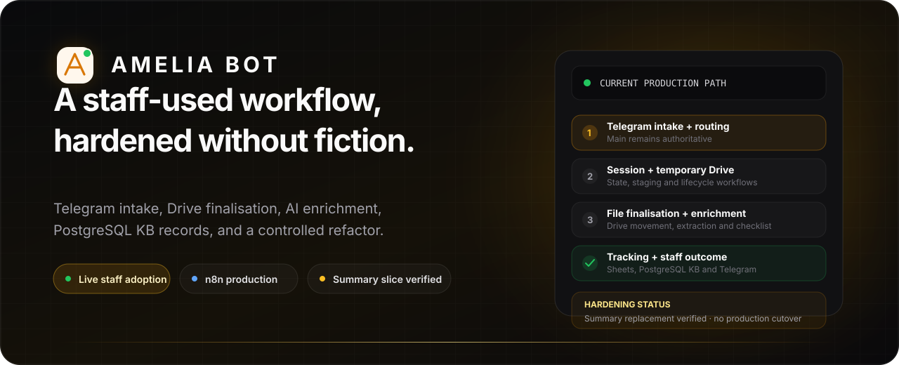
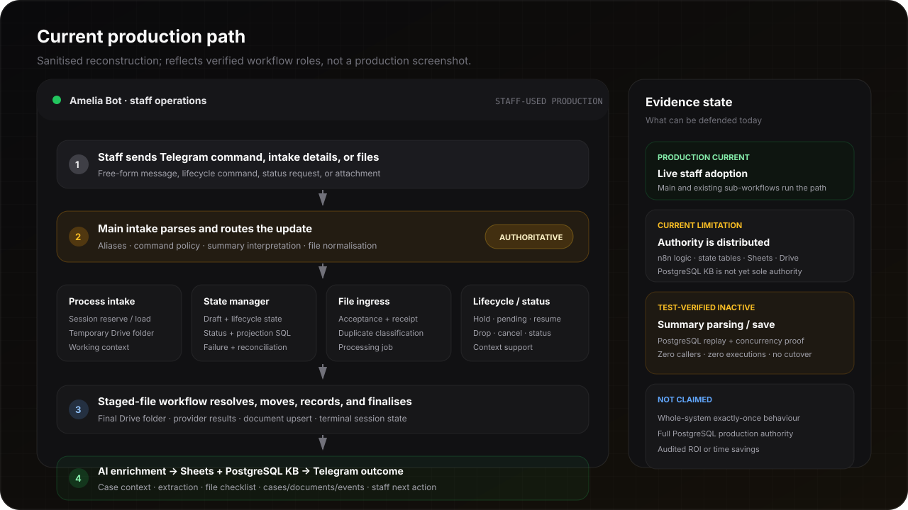

<p align="center">
  
</p>

<p align="center">
  <a href="product-tour.md"><strong>Product tour</strong></a>
  &nbsp;&nbsp;·&nbsp;&nbsp;
  <a href="architecture.md"><strong>Architecture</strong></a>
  &nbsp;&nbsp;·&nbsp;&nbsp;
  <a href="engineering-evidence.md"><strong>Engineering evidence</strong></a>
  &nbsp;&nbsp;·&nbsp;&nbsp;
  <a href="role-and-ownership.md"><strong>Role and ownership</strong></a>
  &nbsp;&nbsp;·&nbsp;&nbsp;
  <a href="demo-script.md"><strong>Demo script</strong></a>
</p>

<p align="center">
  
  
  
  
  
</p>

<p align="center">
  <strong>Built by <a href="https://github.com/joyboy257">Deon Quek</a> — AI / Software Engineer.</strong><br />
  Workflow discovery, n8n architecture, provider integration, PostgreSQL knowledge-base design, production debugging, source-control recovery, testing, and release decisions.
</p>

> [!NOTE]
> **Amelia Bot is a recruiter-facing alias for a production system built for a private professional-services client.** Every visual uses synthetic labels. This showcase excludes the client's identity, customer information, matter identifiers, credentials, production URLs, proprietary rules, and raw workflow exports.

## The honest version

Amelia Bot is not presented as a pristine greenfield platform whose final architecture existed from day one.

It is a **staff-used Telegram-centred intake and file-finalisation system** that grew across n8n workflows, Google Drive, Google Sheets, PostgreSQL knowledge-base records, and AI-assisted enrichment. As the system became more important, I audited it and found that too much application logic and authority had accumulated inside large n8n Code nodes and dynamic SQL paths.

I then led a controlled hardening programme whose target is:

```text
PostgreSQL = durable business state, transaction authority, idempotency and evidence
n8n       = bounded orchestration and provider adapters
providers = Telegram, Google Drive, email and other external side-effect systems
```

That target is **not fully cut over**. The current production Main workflow remains authoritative. A source-controlled Telegram shadow and five replacement controllers were built without production side effects; only the summary parsing/save slice has reached isolated `TEST_VERIFIED` status. It remains inactive and has no production callers.

## Recruiter quick scan

| | |
| --- | --- |
| **What I built** | A production intake and document-operations workflow used by staff through Telegram, with temporary and final Google Drive handling, lifecycle commands, AI-assisted enrichment, operational tracking, and PostgreSQL KB records. |
| **Production truth** | The current n8n Main and its existing sub-workflows remain authoritative. The workflow is live and staff-used; the cleaner PostgreSQL-centred controller architecture is a verified hardening programme, not a completed production cutover. |
| **My role** | Product discovery, workflow design, n8n implementation and remediation, Google provider integration, PostgreSQL KB architecture, test/evidence design, source-control reconstruction, and release decisions. |
| **Core challenge** | Keep a live operational workflow useful while decomposing hidden application services, duplicate-event ambiguity, and distributed state without losing work or introducing unsafe provider effects. |
| **Primary stack** | n8n · PostgreSQL · Telegram · Google Drive · Google Sheets · email providers · bounded AI extraction and enrichment. |
| **Strongest outcome** | Live staff adoption. No unsupported revenue, accuracy, or time-saving number is claimed. |

## See the real production path

<p align="center">
  
</p>

The current operating path is distributed across several workflows:

1. Staff send commands, free-form intake details, and files through Telegram.
2. The Main intake workflow parses the update and routes it into intake, lifecycle, status, or file handling.
3. A process-intake workflow reserves or loads the working session and creates or persists a temporary Drive folder when required.
4. The intake state manager handles draft/session state, lifecycle commands, staging, failure, reconciliation, status, and projections.
5. File-acceptance and ingress workflows register incoming files and classify duplicate or downstream-processing behaviour.
6. The staged-file/finalisation workflow resolves the case, moves files into the final Drive structure, records provider results, and finalises the session.
7. Post-finalisation enrichment extracts structured case context and file-checklist information; operational rows and events are written to tracking and KB surfaces.
8. Telegram returns the staff-facing result or next action.

This is a real workflow estate, not one clean service. That complexity is precisely why the hardening work matters.

## Current production versus target architecture

<p align="center">
  
</p>

| Concern | Current production truth | Hardening target and current evidence |
| --- | --- | --- |
| **Command edge** | Main parses and routes Telegram updates and remains authoritative. | A non-authoritative Telegram normaliser/router/shadow chain passed parity with zero unexpected differences and no side effects; cutover remains blocked. |
| **Application logic** | Significant parsing, session, lifecycle, file, and finalisation logic remains inside large n8n Code and SQL-generating nodes. | Small source-controlled modules and bounded controllers replace hidden application services slice by slice. |
| **Durable data** | PostgreSQL KB records exist alongside n8n state, operational tracking, Google Sheets, and Drive metadata. The whole estate has not yet converged on one canonical ledger. | PostgreSQL becomes the transaction and idempotency authority; n8n becomes orchestration only. |
| **Provider effects** | Telegram, Drive, Sheets, and email operations are executed by existing workflows. | New controllers are deliberately provider-send-disabled until runtime parity, rollback, and cutover evidence exist. |
| **Summary parsing/save** | Current Main and State Manager remain the live path. | Replacement Summary Controller and PostgreSQL functions are test-verified, live-inactive, have zero callers, and are not cut over. |
| **File and finalisation reliability** | Existing file-ingress and staged-file workflows remain active and operational. | Stronger duplicate identities, atomic transitions, high-water marks, and partial-success reconciliation remain later certification slices. |

## What the production system actually does

### Intake and working sessions

- accepts Telegram commands, messages, and attachments;
- starts or loads an intake session;
- creates temporary Drive staging when required;
- parses and updates structured intake summaries;
- supports status and context retrieval.

### Lifecycle operations

The live estate includes commands and paths for hold, pending, resume, drop, cancel, and related state handling. These behaviours are currently distributed across Main, support workflows, and the state manager rather than one clean canonical state machine.

### Files and finalisation

- accepts and registers incoming files;
- stages files against the current intake;
- resolves existing-case file operations;
- moves intended files into final Drive folders;
- records document and case events;
- finalises the intake and returns staff-facing outcomes.

### AI-assisted work

AI is used where unstructured content is genuinely useful: post-finalisation enrichment, police-report or document extraction, file-checklist interpretation, and candidate classification. It does not replace the actual files in Drive or the staff's authority over consequential operations.

## The engineering problem I found

The production system worked, but live inspection showed that application-service responsibilities were concentrated in a few heavy workflows:

- Main combined parsing, aliases, command identity, summary interpretation, file normalisation, and state-changing policy;
- the process-intake workflow combined caller checks, session reservation, and temporary Drive-folder persistence;
- the state manager combined start, load, update, cancel, claim, stage, failure, reconciliation, status, and projection SQL;
- staged-file finalisation combined case resolution, ledgers, Drive movement, receipts, document upsert, and terminal state changes.

A successful n8n execution was therefore not sufficient proof that one canonical business operation had occurred exactly once.

## Evidence-led hardening

| Workstream | Verified state |
| --- | --- |
| **Deterministic source toolchain** | Exact workflow export, source extraction, deterministic regeneration, validation, comparison, deployment preview, and rollback artefacts were established for the workflow estate. |
| **Telegram edge shadow** | A read-only normaliser, command router, and shadow orchestrator were replayed against a 69-case corpus with zero unexpected differences and zero side-effect violations. Main remains authoritative. |
| **Inactive controllers** | New Case, Summary, File Intake, Existing Case File, and Lifecycle controllers were generated and validated with no production callers or provider-send capability. |
| **Summary parsing/save slice** | Test-verified in an isolated disposable PostgreSQL 16 environment; exact replay, versioning, collision handling, stale-state rejection, concurrent edits, and no-partial-write behaviour were proven. |
| **Production cutover** | Not completed. Summary remains inactive; lifecycle, new-case, existing-case file, standard file acceptance, and finalisation slices still require runtime parity and cutover evidence. |

## One prevention that is genuinely verified

For the **inactive summary parsing/save slice**, the database contract has proven behaviour:

- first save creates version 1;
- a legitimate edit creates the next version;
- exact replay returns the original result without another mutation;
- key, transport, command, operation, and bound-session collisions are blocked;
- stale state, wrong scope, wrong target, and malformed summaries are blocked;
- concurrent edits receive distinct versions;
- terminal or superseded sessions cannot be modified;
- failed operations leave no partial version, binding, or session mutation.

This is not described as a whole-system production guarantee. It is a bounded, test-verified replacement slice awaiting later cutover authority.

## Evidence and production claim

The strongest current claim is intentionally narrow:

> **Amelia Bot ran in production for a private client and achieved live staff adoption.**

The supporting engineering claim is also bounded:

> **I inspected and stabilised a complex live n8n workflow estate, established deterministic source and rollback controls, and test-verified the first PostgreSQL-authoritative replacement slice without changing the production path.**

The system has not yet been instrumented with an audited ROI study. The next measurement layer should track active staff usage, eligible workflow volume, intake-to-finalisation cycle time, manual touches, exception rate, rework rate, and completion rate.

## Separate adjacent programme: document intelligence

A later case-intelligence programme explores read-only Drive indexing, document classification, naming proposals, missing-document detection, and human review queues.

Its first milestone is deliberately non-destructive: mirror Drive metadata into PostgreSQL, build inventories, and queue ambiguity. It does **not** prove that automatic document renaming, moving, or the full intelligence layer is part of Amelia's already-adopted production path.

## What this project demonstrates

- **Forward-deployed engineering:** turning an informal staff process into live operating software and adapting it to real behaviour.
- **Workflow systems:** Telegram ingress, n8n orchestration, temporary and final Drive handling, Sheets tracking, PostgreSQL KB events, and AI enrichment.
- **Production judgement:** distinguishing a working production path from a cleaner target architecture that has not yet been cut over.
- **Reliability engineering:** source-controlled workflow generation, shadow parity, rollback evidence, fail-closed candidates, and slice-level database verification.
- **Debugging:** tracing authority and failure across Main, child workflows, database state, and provider effects instead of patching the visible symptom.
- **AI-tool leverage:** using coding agents for bounded implementation and review while retaining architecture, evidence, and release authority.

## Public boundaries

This showcase intentionally excludes:

- the client's real identity, brand, staff, and customers;
- source messages, documents, filenames, and matter identifiers;
- credentials, folder or chat identifiers, webhooks, and production endpoints;
- raw n8n exports, proprietary Code nodes, and private operating rules;
- infrastructure topology and confidential incident payloads;
- unsupported commercial, productivity, or accuracy claims.

The visuals are recruiter-facing reconstructions made from synthetic data. They show verified system shape and programme status without representing production screenshots.

## Explore

- [`product-tour.md`](product-tour.md) — the 90-second truthful recruiter path
- [`architecture.md`](architecture.md) — current production architecture, target boundary, and cutover status
- [`engineering-evidence.md`](engineering-evidence.md) — exact evidence states and remaining gaps
- [`role-and-ownership.md`](role-and-ownership.md) — what I personally owned and how AI coding agents were used
- [`demo-script.md`](demo-script.md) — an interview-safe script that does not overclaim
- [`disclosure-boundaries.md`](disclosure-boundaries.md) — explicit sanitisation rules

---

<p align="center">
  <strong>Deon Quek</strong><br />
  AI / Software Engineer · Singapore<br />
  <a href="https://github.com/joyboy257">GitHub profile</a> · <a href="https://www.linkedin.com/in/deonquek">LinkedIn</a>
</p>
