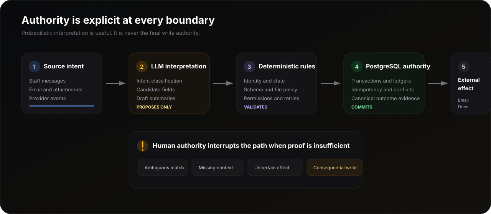

# Amelia Bot — Architecture Case Study

<p align="center">
  
</p>

## System objective

Amelia Bot turns informal staff requests and incoming documents into controlled operational work while preserving a strict separation between:

1. **source intent** from people and providers;
2. **probabilistic interpretation** from an LLM;
3. **deterministic validation and workflow policy**;
4. **authoritative PostgreSQL state**;
5. **human authority and external side effects**.

The central rule is:

> **The model may interpret, classify, and draft. Deterministic controllers and PostgreSQL decide whether business state changes.**

## High-level topology

```text
Staff messages · commands · attachments · provider events
                         │
                         ▼
              Messaging and event ingress
                         │
                         ▼
                   n8n orchestration
       correlation · routing · bounded controller calls
                         │
            ┌────────────┼────────────┐
            ▼            ▼            ▼
       LLM parser   deterministic   human review
     typed candidates  validation    and approval
            └────────────┼────────────┘
                         ▼
              PostgreSQL authority
       state · transactions · ledgers · idempotency
                         │
                         ▼
             Controlled provider effects
             Gmail · Google Drive · Telegram
                         │
                         ▼
            Outcome evidence and reconciliation
```

n8n coordinates the workflow, but it is not the canonical store and does not independently decide whether a durable mutation committed.

## Authority layers

### 1. Source intent

Source inputs include:

- staff commands and free-form messages;
- attachments and document events;
- email and storage-provider responses;
- retries, redelivery, and timeout recovery events.

These inputs are evidence of intent or provider behaviour. They are not authoritative workflow state.

### 2. Bounded LLM interpretation

The model is used for tasks where language ambiguity is the main difficulty:

- intent classification;
- candidate field extraction;
- document and message classification;
- summary drafting;
- clarification-question generation.

Model output must be typed and bounded before deterministic validation. The LLM cannot:

- confirm canonical identity;
- authorize or commit a state transition;
- bypass a review requirement;
- decide that an external action succeeded;
- silently repair a policy or schema failure.

### 3. Deterministic controllers

Controllers own repeatable rules such as:

- current-context and canonical-record resolution;
- legal state transitions;
- required-field and schema validation;
- file acceptance and ingress policy;
- permission and approval requirements;
- retry, rejection, reconciliation, and escalation decisions.

This layer converts a model proposal into one of four outcomes:

```text
accept for authoritative commit
request clarification
require human review
reject with an explicit reason
```

### 4. PostgreSQL authority

PostgreSQL is the operational source of truth for:

- active sessions and canonical matters;
- lifecycle state and transition history;
- file-ingress records;
- operation keys and payload fingerprints;
- mutation outcomes and provider references;
- conflicts, uncertain effects, and reconciliation state;
- durable evidence required before completion is acknowledged.

A successful n8n execution or provider response does not replace a committed database record.

### 5. Human authority and external effects

Human review is required when:

- more than one record or person is a plausible match;
- required context remains missing;
- a document cannot be safely classified or routed;
- a requested action is consequential or externally visible;
- internal state and provider state disagree;
- the system cannot prove whether a prior effect completed.

External effects remain controlled operations whose provider identifiers and outcomes are recorded for retry and reconciliation.

## Core state groups

| Group | Representative states | Authority |
| --- | --- | --- |
| **Intake** | context resolution, new intake, draft summary, awaiting confirmation | Deterministic controller with staff confirmation |
| **Matter lifecycle** | active, hold, pending, resumed, dropped, cancelled, completed | PostgreSQL state machine |
| **File ingress** | received, registered, staged, classified, accepted, review required, failed | Ingress ledger and deterministic validation |
| **External effect** | queued, attempted, delivered, retryable, uncertain, permanently failed | Durable effect and reconciliation record |
| **Exception handling** | ambiguous identity, invalid payload, provider disagreement, manual review | Explicit escalation state |

## Write path

A consequential write follows this sequence:

1. Receive an input with correlation context.
2. Produce a typed interpretation when language processing is required.
3. Resolve the canonical scope and current state.
4. Validate permissions, transition rules, required fields, and provider policy.
5. Stop for clarification or human authority when necessary.
6. Reserve an idempotent operation inside the database boundary.
7. Perform the bounded provider effect when applicable.
8. Record provider and outcome evidence.
9. Commit canonical state or uncertain-effect status.
10. Return a confirmed result, replay, conflict, or visible escalation.

Completion is never inferred solely from a model statement or an orchestration node finishing.

## Idempotency contract

Each durable operation is represented by fields equivalent to:

```text
operation_key
payload_fingerprint
operation_type
canonical_scope
status
provider_reference
result_payload
created_at
completed_at
```

Expected behaviour:

| Input | Behaviour |
| --- | --- |
| New key + valid payload | Reserve and execute the operation |
| Same key + same payload + committed result | Replay the recorded result |
| Same key + different payload | Reject as an idempotency conflict |
| Existing uncertain provider effect | Reconcile before another external effect |
| Database authority unavailable | Do not claim completion |

The contract protects against repeated staff actions, webhook redelivery, workflow retries, and ambiguous partial success.

## Provider partial-success model

An external provider can accept an operation while the local workflow times out before recording the acknowledgement.

The safe response is not to retry blindly.

```text
provider result known       → record and complete
provider result definitely failed → retry under policy
provider result uncertain   → reconcile by provider reference
no durable reservation      → stop before effect where possible
```

Uncertain effects remain visible operational states until evidence resolves them.

## Integration responsibilities

### Telegram or messaging interface

- Accept staff requests, commands, corrections, and attachments.
- Return missing-information prompts, confirmations, outcomes, or escalation notices.
- Never serve as the canonical workflow store.

### n8n

- Coordinate bounded controllers and provider calls.
- Carry correlation and idempotency identifiers.
- Expose orchestration history for debugging.
- Keep mutation authority out of giant, opaque code nodes.

### Gmail and Google Drive

- Perform provider-specific email and file operations.
- Return stable provider identifiers and results.
- Remain behind validation, retry, and exception boundaries.

### PostgreSQL

- Enforce state and transaction invariants.
- Own operation reservation, exact replay, and conflict detection.
- Preserve evidence for audit and reconciliation.

## Observability model

Different evidence surfaces answer different questions:

| Surface | Question answered |
| --- | --- |
| n8n execution history | Which orchestration steps ran, failed, retried, or timed out? |
| PostgreSQL operation ledger | What was authoritatively reserved, committed, replayed, or rejected? |
| File-ingress records | Was a file received, classified, routed, held, or rejected? |
| Provider reference | Which email, storage, or message effect corresponds to the operation? |
| Human-review state | Which ambiguity remains unresolved and who must decide? |

No single surface is treated as complete evidence by itself.

## Failure posture

The system prefers a visible, recoverable escalation over silent best effort.

| Failure | Safe behaviour |
| --- | --- |
| Malformed model output | Reject or boundedly repair the schema; do not write state |
| Duplicate delivery | Replay the committed result or reject a changed payload |
| Stale state | Reject the transition and return the current authoritative state |
| Provider timeout | Record uncertain state and reconcile before another effect |
| Invalid file | Preserve ingress evidence and return rejection or review state |
| Missing context | Ask for clarification or route to human review |
| Database unavailable | Stop before effects where possible and never report completion |
| Provider/database disagreement | Preserve both references and open reconciliation |

## Confidentiality boundary

This document describes reusable engineering patterns. It excludes the client's identity, customer data, private terminology, production identifiers, credentials, raw workflow exports, proprietary rules, and infrastructure topology.
